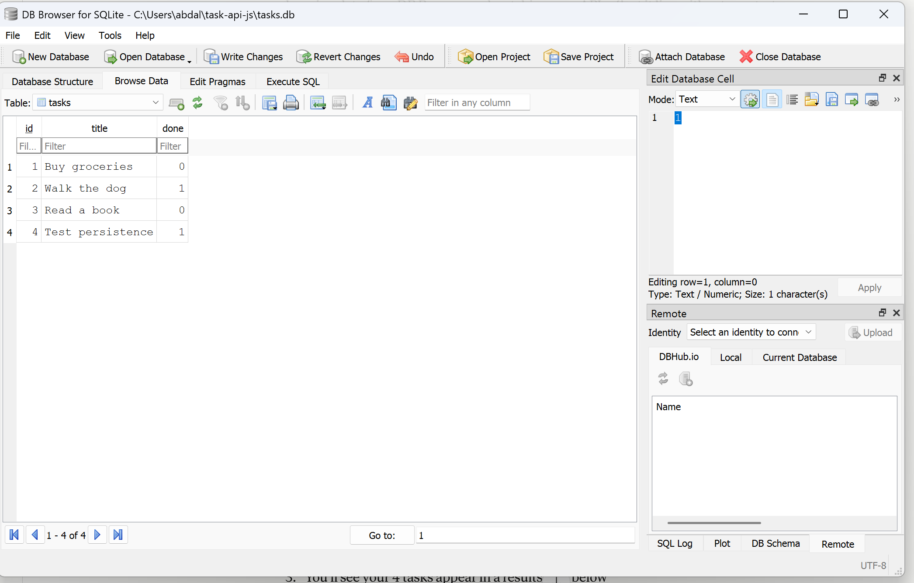

# Task API — layered version, now backed by SQLite

This CRUD API started as a single 176-line `index.js` in Assignment 1, refactored
into **three layers** so each file has one job. Assignment 2 swapped the storage
layer from an in-memory array to a real **SQLite** database (`tasks.db`) — every
endpoint, status code, and validation rule behaves exactly as before, but data
now survives a server restart.

## Run it

```bash
npm install
npm start          # http://localhost:3000  ·  docs at /docs
```

On first run, `tasks.db` is created automatically, the `tasks` table is created
if missing, and 3 example tasks are seeded — but only if the table is empty, so
restarting never duplicates them.

## Endpoints

| Method | Path          | Description               |
|--------|---------------|----------------------------|
| GET    | `/`           | API info                   |
| GET    | `/health`     | Health check                |
| GET    | `/tasks`      | List all tasks              |
| GET    | `/tasks/{id}` | Get a single task by id      |
| POST   | `/tasks`      | Create a new task            |
| PUT    | `/tasks/{id}` | Update a task's title and/or done |
| DELETE | `/tasks/{id}` | Delete a task                |
| GET    | `/stats`      | Task counts (total/done/open) |
| POST   | `/reset`      | Restore the 3 seed tasks     |

## Example request

```bash
curl.exe -i -X POST http://localhost:3000/tasks -H "Content-Type: application/json" -d '{"title":"Buy milk"}'
```

Response:

HTTP/1.1 201 Created
content-type: application/json

{"id":5,"title":"Buy milk","done":false}


## The layers

Client
│ HTTP request
▼
src/routes/ ← HTTP layer: read the request, call a service, send the response
│ plain function calls (ids, bodies)
▼
src/services/ ← business rules: validation, id generation, "not found" logic
│ findAll / findById / create / update / remove
▼
src/repositories/ ← data access: the ONLY file that knows where tasks are stored
│
▼
Storage (in-memory in A1 → SQLite now → Postgres in A3)


| File | Job | Knows about… |
|---|---|---|
| `src/routes/tasks.routes.js` | Translate HTTP ↔ service calls | `req` / `res`, status codes |
| `src/services/tasks.service.js` | The business rules | validation, id rules — **not** HTTP, **not** storage |
| `src/repositories/tasks.repository.js` | Store & fetch tasks | the data store only |
| `src/middleware/error-handler.js` | Map thrown errors → status codes | `ValidationError`→400, `NotFoundError`→404 |
| `src/errors.js` | Domain error types | nothing about HTTP |
| `src/app.js` | Wire everything into Express | the pieces, not their internals |
| `index.js` | Start the server | just the port |

## Why this matters

**Separation of concerns.** Each layer changes for one reason. HTTP details change → only the routes. A business rule changes → only the service. **Storage changes → only the repository.**

Assignment 2 proved this directly: moving from an in-memory array to SQLite required rewriting exactly one file, `tasks.repository.js`. The routes and the service — the API contract clients depend on — never changed at all.

## Database

**Why SQLite:** a single file, zero setup, no separate server to install or run — ideal for a small project, and it gives real persistence.

**Where it lives:** `tasks.db`, in the project root, created automatically on first run. It's git-ignored, so every fresh clone starts with a clean database rather than someone else's data.

**Schema:**
```sql
CREATE TABLE IF NOT EXISTS tasks (
  id INTEGER PRIMARY KEY AUTOINCREMENT,
  title TEXT NOT NULL,
  done INTEGER NOT NULL DEFAULT 0
);
```

**Viewing the database:** I used [DB Browser for SQLite](https://sqlitebrowser.org/) to inspect and manually query `tasks.db`.



**Example query I ran directly in DB Browser:**
```sql
UPDATE tasks SET done = 1;
```
This marked every task as completed. After clicking "Write Changes," calling `GET /tasks` on the running API immediately reflected the change — no restart needed, since the API and DB Browser read the same file live.