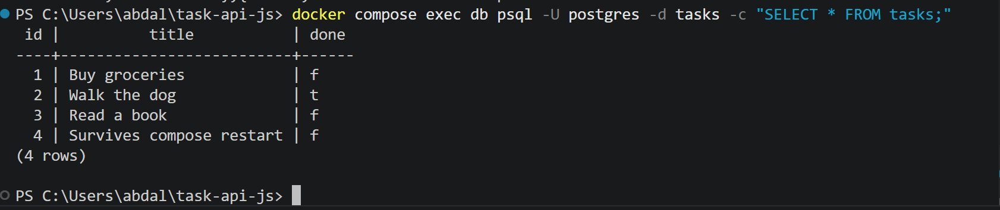

# Task API — layered, containerized, backed by Postgres

This CRUD API started as a single 176-line `index.js` in Assignment 1, was
refactored into **three layers** so each file has one job, then moved through
two storage swaps: an in-memory array (A1) → SQLite (A2) → a real **PostgreSQL**
database running in Docker (this version). Every endpoint, status code, and
validation rule has stayed identical across all three — only the storage layer
underneath has ever changed.

## Run it

**Requirements:** [Docker Desktop](https://www.docker.com/products/docker-desktop/) installed and running.

```bash
cp .env.example .env
docker compose up
```

That's it — one command builds your app's image, starts a Postgres container
with a persistent volume, waits for the database to be ready, then starts the
API at `http://localhost:3000` (docs at `/docs`).

On first run, the `tasks` table is created automatically and 3 example tasks
are seeded — but only if the table is empty, so restarting never duplicates them.

### Environment variables

Copy `.env.example` to `.env` before running. Inside Docker Compose, the app
reaches the database by its service name (`db`), not `localhost` — this is
already set correctly in `compose.yaml`; `.env` is only used if you run the
app directly on your machine outside of Docker.

## Endpoints

| Method | Path          | Description               |
|--------|---------------|----------------------------|
| GET    | `/`           | API info                   |
| GET    | `/health`     | Health check                |
| GET    | `/tasks`      | List all tasks              |
| GET    | `/tasks/{id}` | Get a single task by id      |
| POST   | `/tasks`      | Create a new task            |
| PUT    | `/tasks/{id}` | Update a task's title and/or done |
| DELETE | `/tasks/{id}` | Delete a task                |
| GET    | `/stats`      | Task counts (total/done/open) |
| POST   | `/reset`      | Restore the 3 seed tasks     |

## Example request

```bash
curl -i -X POST http://localhost:3000/tasks -H "Content-Type: application/json" -d '{"title":"Buy milk"}'
```

Response:

HTTP/1.1 201 Created
content-type: application/json

{"id":5,"title":"Buy milk","done":false}


## The layers

Client
│ HTTP request
▼
src/routes/ ← HTTP layer: read the request, call a service, send the response
│
▼
src/services/ ← business rules: validation, id generation, "not found" logic
│
▼
src/repositories/ ← data access: the ONLY file that knows where tasks are stored
│
▼
Storage (in-memory in A1 → SQLite in A2 → Postgres now)


Moving from SQLite to Postgres required rewriting exactly one file,
`tasks.repository.js` (plus adding `async`/`await` through the service and
routes, since Postgres talks over a network instead of reading a local file).
The actual business rules and HTTP handling never changed.

## Containers

**Why Docker:** instead of installing Postgres directly and fighting OS-specific
setup, Postgres runs as a container — a ready-made, isolated box that behaves
identically on any machine. `docker compose up` starts both the app and the
database together, already able to talk to each other.

**The stack:**
- `api` — this Node/Express app, built from the project's `Dockerfile`
- `db` — the official `postgres` image, with a named volume (`taskdata`) so
  data survives even if the containers are destroyed and recreated

**Persistence proven:** created a task, ran `docker compose down` (which fully
removes both containers) followed by `docker compose up` — the task was still
there afterward, because the volume kept the data independent of the containers.

## Database

**Schema:**
```sql
CREATE TABLE IF NOT EXISTS tasks (
  id SERIAL PRIMARY KEY,
  title TEXT NOT NULL,
  done BOOLEAN NOT NULL DEFAULT false
);
```

**Viewing the database directly**, bypassing the API entirely:
```bash
docker exec -it taskdb psql -U postgres -d tasks -c "SELECT * FROM tasks;"
```

id | title | done
----+---------------+------
1 | Buy groceries | f
2 | Walk the dog | t
3 | Read a book | f




## Notes on secrets

The real `DATABASE_URL` (with the database password) lives in `.env`, which is
git-ignored and never committed. `.env.example` is committed instead, with the
same keys but placeholder values, so anyone cloning this repo knows what to set.
What to do